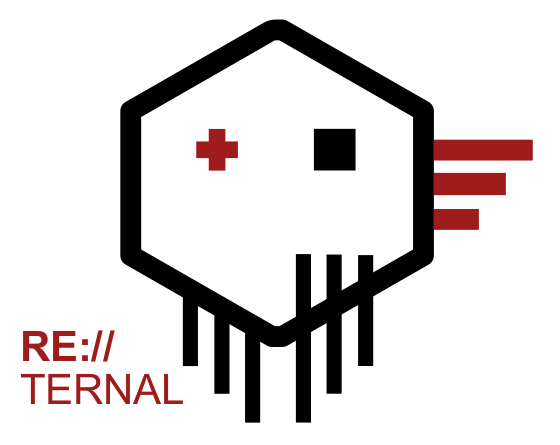
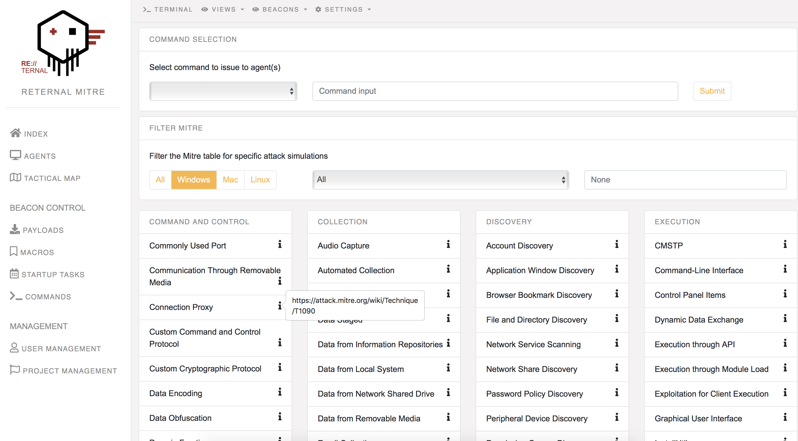

#  RE:TERNAL
-------------

---------------------

RE:TERNAL is a centralised purple team simulation platform. Reternal uses agents installed on a simulation network to execute various known
red-teaming techniques in order to test blue-teaming capabilities. The simulations are mapped to the MITRE ATT&CK framework.

#### Screenshot

#### Features
- **Interactive console**
  * Direct and manual task execution is available via an interactive (JQuery) terminal.
- **Builtin commands**
  * Ready to go- commands are already configured on each agent. Users are able to execute portscans, wmi commands, memory attacks and/or a combination of tasks in the form of a complete simulation.
- **Custom Python and Powershell scripts**
  * Aside from the builtin commands, users can upload their own Python or Powershell script to RE:TERNAL.
- **Push commands to multiple machines at once**
  * Users can select multiple agents in the overview to push a specific task or simulation to all agents at the same time.
- **Scheduled command option**
  * Schedule tasks or simulations on a specific date/time to be executed.
- **Task history**
  * Every agent has its own custom output page. All the output given by the agent is listed there.
- **Make personal macros for most used commands**
  * Each user can create his own aliases for often used commands with fixed input.

#### Pre-Requirements
  - MongoDB
  - Redis (for task messaging)
  - Celery (for task management)
  - Python v3.6
  - Flask and +- 20 PIP modules (found in requirements file)

#### Special Thanks
  - MITRE ATT&CK - Framework used for mapping simulations: https://attack.mitre.org/wiki/Main_Page
  - Pupy Python - Using PuPy to create Windows payloads: https://github.com/n1nj4sec/pupy
  - Uber Metta -  Using Metta's templates for MITRE techniques with small (optional) adjustments to the purple_action format: https://github.com/uber-common/metta

#### Feature Requests & Bugs
We use the Github to manage Feature requests and Bug reports.

#### Developers and Contact

Joey Dreijer < joeydreijer@gmail.com >  
Yaleesa Borgman < yaleesa@gmail.com >

#### Whats up with the name?

This project has been re-developed so many times, it will probably never really finish. Hence RE (Redo) and Ternal (Eternal).
